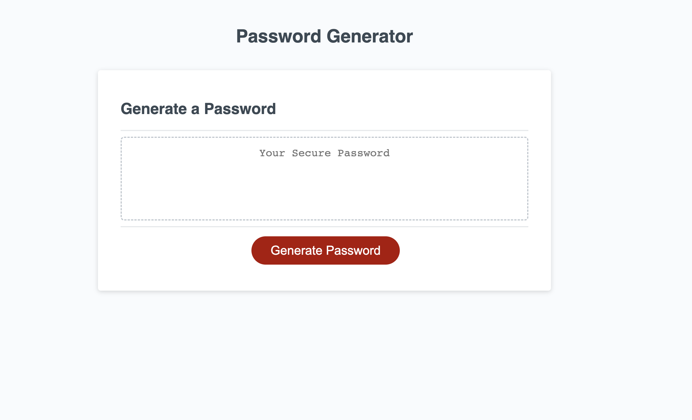

# Sal-password-generator-refactor-week-3
- Refactored password Generator

## Description

- Refactored a password generator so that it can generate randomised passwords for better security for users. Password can be between 8 and 128 characters long and the user has the option to choose if it contains uppercase, lowercase, numbers and symbols as per their needs.

## Table of Contents

- [Installation](#installation)
- [Usage](#usage)
- [Credits](#credits)
- [License](#license)

## Installation

 Refactored Password generator at at https://sal8298.github.io/Sal-Portfolio/

Repository containing the code for Refactored Password generator can be found at https://github.com/Sal8298/Sal-Portfolio

## Usage
This is a screenshot of the the page.

- Clicking the Generate Password button will lead to a series of prompts that will allow the user to make a customised random password.

## Credits

- Collaborators:
- Salahuddin Imdad (https://github.com/Sal8298)
- Krister Myriønn (https://github.com/kristermyr)
- Nicholas Mamberger (https://github.com/NickHM05)
- Garrett Winter (https://github.com/garrettWinter)

## License

MIT License

Copyright (c) [2022] [Sal-password-generator-refactor-week-3]

Permission is hereby granted, free of charge, to any person obtaining a copy
of this software and associated documentation files (the "Software"), to deal
in the Software without restriction, including without limitation the rights
to use, copy, modify, merge, publish, distribute, sublicense, and/or sell
copies of the Software, and to permit persons to whom the Software is
furnished to do so, subject to the following conditions:

The above copyright notice and this permission notice shall be included in all
copies or substantial portions of the Software.

THE SOFTWARE IS PROVIDED "AS IS", WITHOUT WARRANTY OF ANY KIND, EXPRESS OR
IMPLIED, INCLUDING BUT NOT LIMITED TO THE WARRANTIES OF MERCHANTABILITY,
FITNESS FOR A PARTICULAR PURPOSE AND NONINFRINGEMENT. IN NO EVENT SHALL THE
AUTHORS OR COPYRIGHT HOLDERS BE LIABLE FOR ANY CLAIM, DAMAGES OR OTHER
LIABILITY, WHETHER IN AN ACTION OF CONTRACT, TORT OR OTHERWISE, ARISING FROM,
OUT OF OR IN CONNECTION WITH THE SOFTWARE OR THE USE OR OTHER DEALINGS IN THE
SOFTWARE.